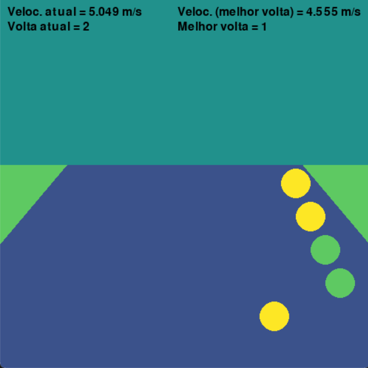

# TCC

## Objetivo

O objetivo desse código é receber dados em tempo real de um veículo em uma corrida e apresentar uma visualização para o piloto do que foi feito por ele na melhor volta (direção e velocidade).

## Funcionamento

São utilizados dois códigos principais, um que faz a leitura de dados tratados que foram retirados de uma corrida da equipe FormulaCEM (geraDados.py) e escreve num arquivo intermediário. O outro código faz a leitura desses dados, tratando todas as informações recebidas, além de apresentar a visualização do piloto (leDados.py).
Será feito um breve detalhamento desse código, explicando as configurações necessárias, como é feita a comunicação e o tratamento matemático dos dados.

### Configuração

Para a etapa de configuração, é necessário informar a largura da pista e uma quantidade mínima de pontos para que a volta seja considerada uma volta com tempo válido.

### Estrutura dos dados

Os dados estão dispostos da seguinte forma:
(timestamp lap posX posY speed fuel*)

Abaixo um exemplo dos dados:
(20:23:31.000000 1 -26.235885 -48.88543 6.023 1)

### Comunicação
A comunicação é feita entre a GeraDados.py e LeDados.py através do arquivo texto commnication.txt.
Após a escrita dos dados no arquivo de texto dataPoints.txt, GeraDados.py escreve o valor 1 em communication.txt. Quando LeDados.py faz a leitura, escreve 0 em communication.txt. A frequência do script de leitura utilizada foi de 0.1/s, a frequência de escrita utlizada foi de 0.7/s.

### GeraDados.py
Atualmente pega dados de um dataset gerado pela equipe FormulaCEM, onde foram feitas 5 voltas.
Os dados não possuíam um controle de quando foi completada a volta, o que foi colocado manualmente.
Além disso, os pontos onde o carro ficava parado, com velocidade igual a zero, também foram retirados, pois era uma prova de testes e haviam muitos pontos de parada do carro.

### LeDados.py
O script mais complexo, o cerne do trabalho. Serão separadas em algumas etapas, visando a explicação.

#### Primeiro ciclo
No primeiro ciclo, ocorre a leitura da volta inicial, que será a melhor volta até que seja feita uma volta em menor tempo.
Essa melhor volta é escrita no arquivo bestLap.txt, no mesmo formato descrito.
Depois disso, são geradas retas, com base na largura da pista. Conforme mostrado na imagem:

Os pontos em preto são pontos por onde o carro passou, sendo B o ponto referencial do exemplo e A o ponto anterior.
Para traçar o segmento de reta YZ, traça-se uma reta entre AB, a reta gerada deve ser perpendicular aquela, passando por B.
Y deve ter metade da largura da pista em relação a B para um lado, e Z para o outro. Com isso, descobre-se dois pontos para cada ponto da melhor volta. Na imagem é possível ver esses pontos para a volta inicial.

#### Ciclos
A partir de agora, a cada novo ponto recebido o script tenta encontrar em que parte da pista o piloto está, gerando regiões com base nos pontos gerados na melhor volta.
Por exemplo, como o ponto C da imagem está dentro da região delimitada, podemos mostrar pra ele o que foi feito na melhor volta.

Com a região encontrada, o sistema pega os próximos 5 pontos que foram feitos na melhor volta, como mostra a imagem abaixo.

C é o ponto atual, D o ponto anterior. Os pontos F, G, H, I e J são os próximos pontos feitos na melhor volta, todos a esquerda da reta, indicando que o piloto fez um movimento mais a esquerda naquela ocasião. (As distâncias são l, m, n p e q).

#### Display
Na imagem, uma saída para exemplificar o sistema:

#### Volta completa
A cada volta completada, o sistema verifica se o tempo decorrido para completar essa volta foi menor que a melhor volta (pegando o primeiro e último tempo), além de verificar se atende ao número mínimo de pontos. Caso cumpra os dois requisitos, será reescrita a melhor volta em bestLap.txt, além de ser gerada as novas regiões.

### Perguntas a serem respondidas?
- Por que pygame?

### Melhorias/Trabalhos futuros
- Aproximação por interpolação